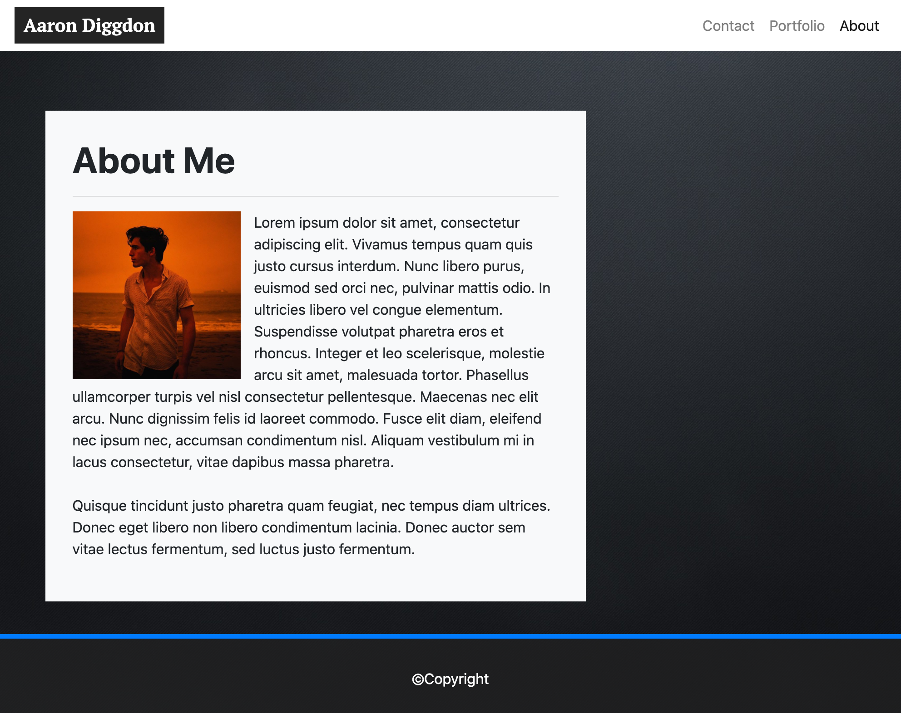
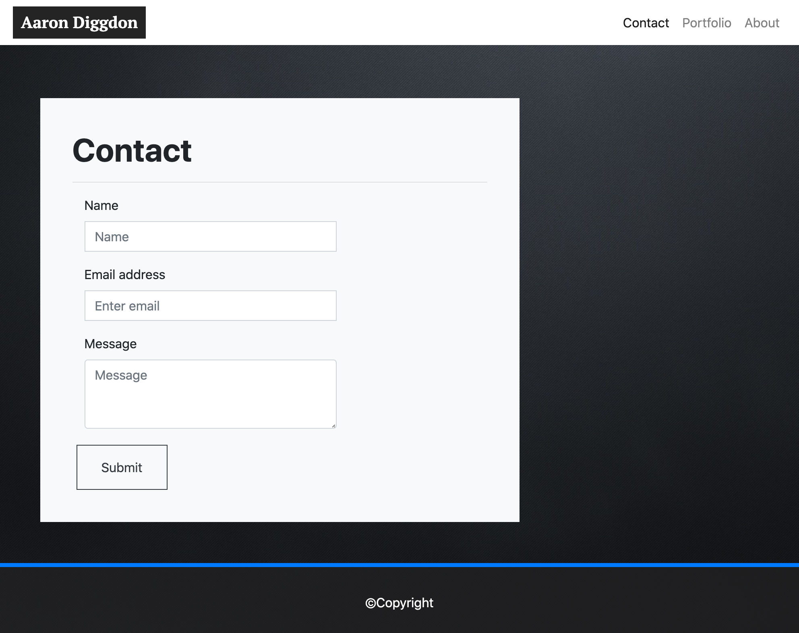
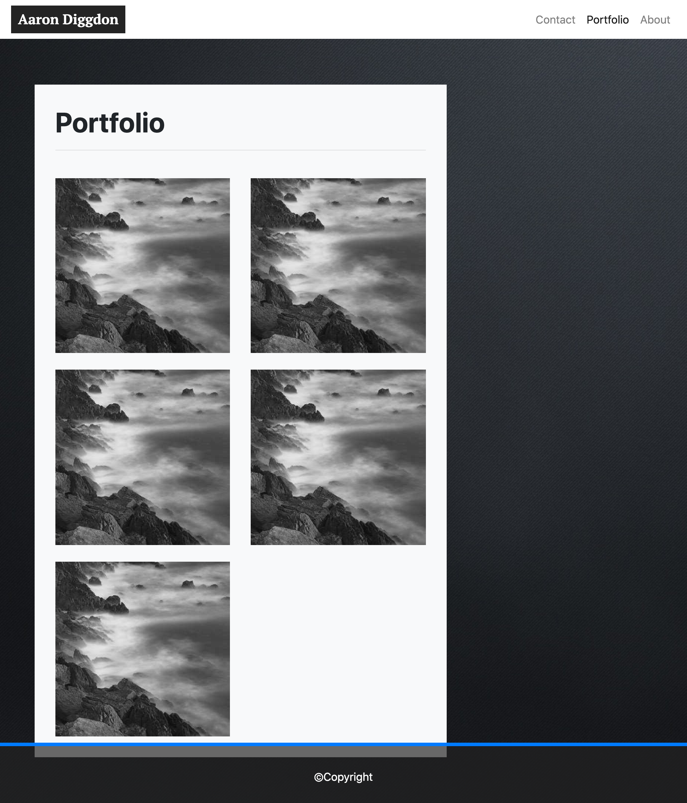
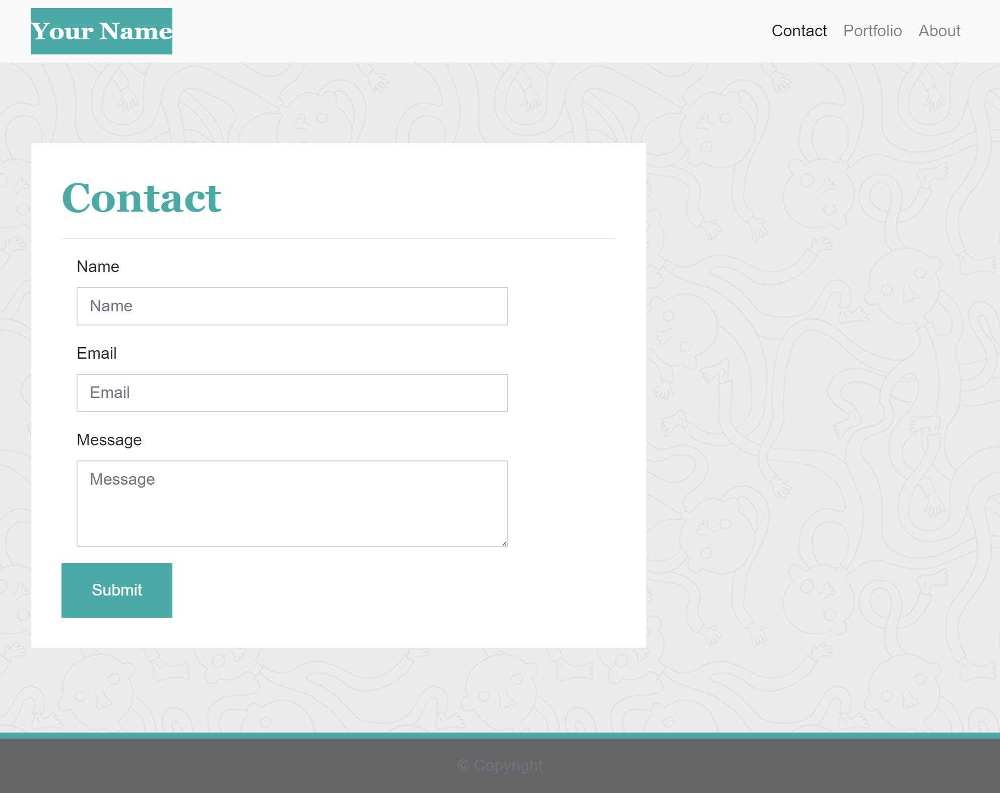

# Portfolio Website Template

 
 
 

## Objective

Create a website template that is mobile responsive and holds the same structure as the example, at different screen widths.

 
 
 
 
 
 
 

This included creating an contact, portfolio and index page.

That should have the same format as these.

 
 
 
 

 
 
 
 
 

<h style="text-align:center;">

 ## Technology Used
  
  

To achieve this, a combination of 

 
 

<h style="text-align:center;">

<h style="color:#377ec8"> **HTML**
 

<h style="color:#377ec8">**CSS**
 

<h style="color:#377ec8">**Bootstrap**
 

<h style="color:#377ec8">**Inspect Element**
 

<h style="color:#377ec8">**Visual Studio Code**
 

<h style="color:#377ec8">**Terminal**

 
 

was used.

 
 
 
 
 

 
 
 
 
 

## Author
 
<h style="font-size:24px; color:#377ec8"> 

 ## Aaron Diggdon 
</h>

 
 
 
 

 
 
 
 

 
 
 
 
 

